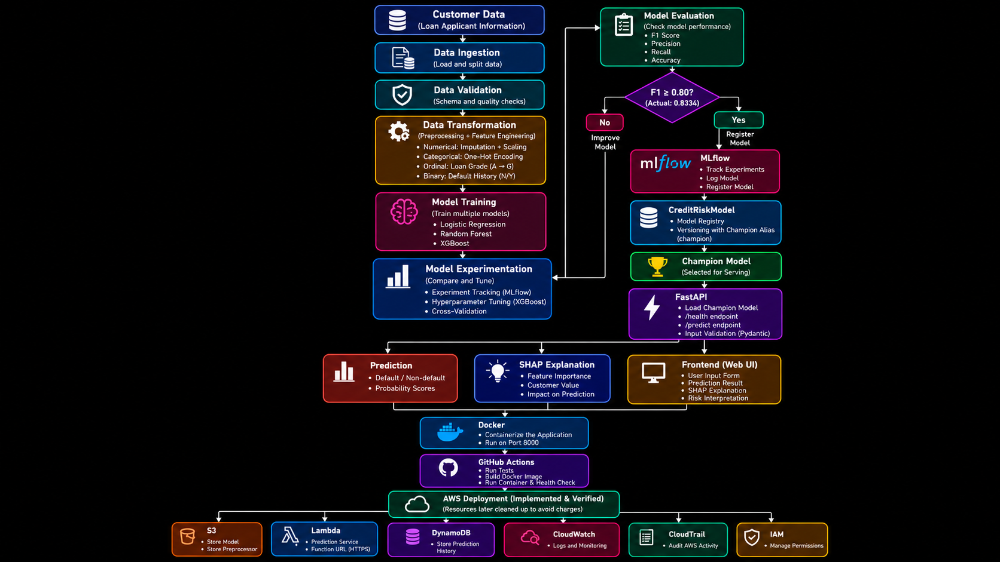

# Credit Risk Prediction MLOps

An end-to-end Machine Learning and MLOps project for predicting whether a loan applicant is likely to default.

The project covers the complete journey from data preparation and model training to model tracking, explainability, API serving, Docker, CI/CD, and cloud deployment.

---

## Project Overview

The system takes customer and loan information and predicts the risk of loan default.

The prediction is:

- `0` → Non-default
- `1` → Default

The project is not only about training a machine learning model. It also includes the complete MLOps workflow required to manage, test, explain, serve, and deploy the model.

### Complete Flow

```text
Customer Data
     ↓
Data Ingestion
     ↓
Data Validation
     ↓
Data Transformation
     ↓
Model Training
     ↓
Model Experimentation
     ↓
Model Evaluation
     ↓
MLflow Model Registry
     ↓
Champion Model
     ↓
FastAPI Prediction Service
     ↓
SHAP Explanation
     ↓
Frontend
     ↓
Docker
     ↓
GitHub Actions
     ↓
AWS Deployment Architecture


### Project Architecture


